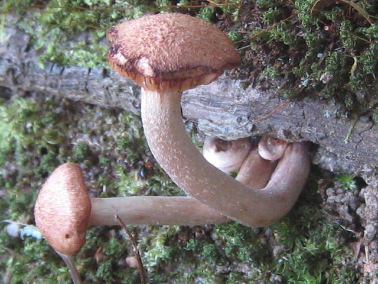
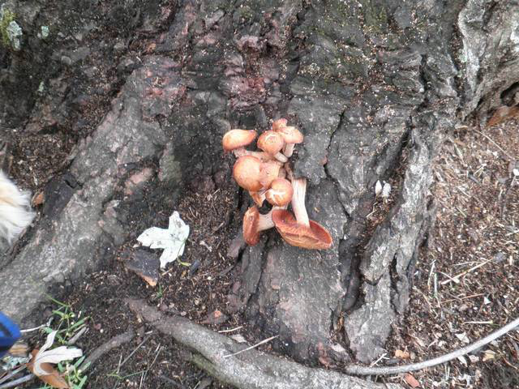
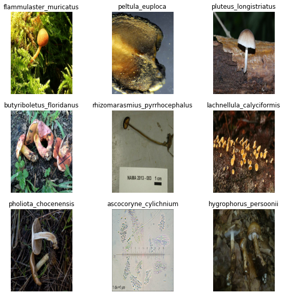
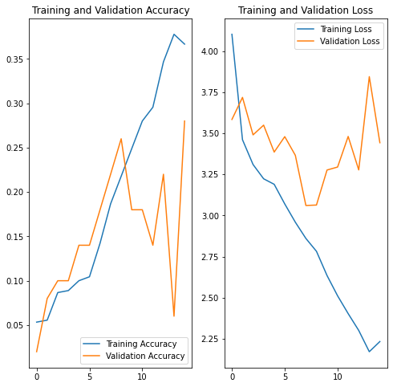

# Image-based mushroom identification
- [**@github.com**](https://github.com/Jesssullivan/mo-image-identifier/) <br>
- [**@github.io**](https://jesssullivan.github.io/mo-image-identifier/) <br>
- [**Web Annotator @ ai.columbari.us**](https://ai.columbari.us/annotator/photo) <br>
- [**Artifacts**](#artifacts) <br>

*Local Processing:* <br>
- [**Setup**](#setup) <br>
- [**Preprocess**](#preprocess) <br>
- [**Structures**](#structures) <br>
- [**Train**](#train) <br>


*Remote & Notebook Processing:* <br>
- [**Google Colab**](#ncolab) <br>
- [**Remote Jupyter & Notes**](#notes) <br>

- - -


<h4 id="artifacts"> </h4>


## *Artifacts:*

|**Dataset:**|[*images.tgz*](https://mo.columbari.us/static/images.tgz)|[*train.tgz*](https://mo.columbari.us/static/train.tgz)|[*test.tgz*](https://mo.columbari.us/static/test.tgz)|
|---|---|---|---|
|**Annotator json:**|[*images.json*](https://mo.columbari.us/static/images.json)|[*categories.json*](https://mo.columbari.us/static/categories.json)|[*config.json*](https://mo.columbari.us/static/config.json)|
|[**@ai.columbari.us:**](https://ai.columbari.us/classify/server)|[***Web Annotator!***](https://ai.columbari.us/annotator/photo)|[*mo_example_task.tar.gz*](https://mo.columbari.us/static/mo_example_task.tar.gz)|[*mo_example_task.zip*](https://mo.columbari.us/static/mo_example_task.zip)|


- - -


<h4 id="setup"> </h4>


## *Setup (Locally)*

```console
# venv:
python3 -m venv mushroomobserver_venv
source mushroomobserver_venv/bin/activate
pip3 install -r requirements.txt
```


- - -


<h4 id="preprocess"> </h4>


## *preprocess: (Locally)*

```
python3 preprocess
```

- Fetches & saves off gbif archive to `./static/`
  - Checks the archive, tries loading it into memory etc
- Fetches Leaflet Annotator binary & licenses from [JessSullivan/MerlinAI-Interpreters](https://github.com/Jesssullivan/MerlinAI-Interpreters)
- Generates an `images.json` annotation file from the 500 assets selected by Joe & Nathan
- Generates an `categories.json` file from the 36 annotatable classes selected by Joe & Nathan
- Downloads, organizes the 500 selected assets from *images.mushroomoberver.org* at `./static/images/<category>/<id>.jpg`
  - writes out images archive
- More or less randomly divvies up testing & training image sets
  - writes out example testing/training archives; (while training it'll probably be easier to resample directly from images.tgz from keras)


<h4 id="structures"> </h4>


### *Structures:*


- *Leaflet Annotator `images.json` Structure:*
  - **id**: *filename* The MO image filename
  - **category_id**: The binomen defined in the `./static/sample_select_assets.csv`; for directories and URIs this is converted to snake case.
  - **taxon_id**:  the MO taxon id integer in the case of `*_v1.csv`; otherwise duplicate of `category_id` for now (eg `*_v2.csv`)
  - **url**: Temporary elastic ip address this asset will be available from, just to reduce any excessive / redundant traffic to *images.mushroomobserver.org*
  - **src**: *imageURL* The asset's source URL form  Mushroom Observer
  ```
  [{
  "id": "290214.jpg",
  "taxon_id": "12326",
  "category_id": "Peltula euploca",
  "url": "https://mo.columbari.us/static/images/peltula_euploca/290214.jpg",
  "src": "https://mushroomobserver.org/images/640/290214.jpg"
  }]
  ```
- *`./static/` directory structure following `python3 preprocess`:*
  ```
  ├── static
  ├── categories.json
  ├── gbif.zip
  ├── images
  |   ...
  │   └── peltula_euploca
  │       ├── <123456>.jpg
  │       ...
  │       └── <654321>.jpg
  │   ...
  ├── images.tgz
  ├── testing
  |   ...
  │   └── peltula_euploca
  │       ├── <234567>.jpg
  │       ...
  │       └── <765432>.jpg
  │   ...
  ├── testing.tgz
  ├── training
  |   ...
  │   └── peltula_euploca
  │       ├── <345678>.jpg
  │       ...
  │       └── <876543>.jpg
  │   ...
  ├── images.json
  ├── training.tgz
  ├── js
  │   ├── leaflet.annotation.js
  │   └── leaflet.annotation.js.LICENSE.txt
  ├── md
  │   ├── output_10_0.png
  │   ├── output_11_0.png
  │   ├── output_17_0.png
  │   └── output_27_0.png
  ├── mo_example_task
  │   ├── categories.json
  │   ├── config.json
  │   └── images.json
  ├── sample_select_assets_v1.csv
  ├── sample_select_assets_v2.csv
  ├── test.tgz
  └── train.tgz
  ...
  ```


  ## *Train (Locally)*

  ```
  python3 train
  ```

  - Fetches, divvies & shuffles train / validation sets from within Keras using archive available at [*mo.columbari.us/static/images.tgz*](https://mo.columbari.us/static/images.tgz)
  - More or less running Google's demo transfer learning training script in [`train/training_v1.py`](train/training_v1.py) as of *03/17/21*, still need to bring in training operations and whatnot from merlin_ai/ repo --> experiment with Danish Mycology Society's ImageNet v4 notes


  ### *Local Jupyter:*

  - One may also open and run notebooks locally like this:
    - rename ipython notebook:
    ```
    cp train/notebook/training_v1.ipynb.bak train/notebook/training_v1.ipynb
    ```
    - launch jupyter:
    ```
    jupyter notebook
    ```
    - or without authentication:
    ```
    jupyter notebook --ip='*' --NotebookApp.token='' --NotebookApp.password=''
    ```


- - -


  <h4 id="colab"> </h4>


  ### *Google Colab:*

  - [@gvanhorn38](https://github.com/gvanhorn38/) pointed out Google Colabs's neat Juptyer notebook service will train models for free if things are small enough- I have no idea what the limits are- fiddle with their [***intro to image classification on Google Colab here***](https://colab.research.google.com/github/tensorflow/docs/blob/master/site/en/tutorials/images/classification.ipynb), its super cool!


<h4 id="notes"> </h4>


## *Notes:*


  ## *Preprocess: (Jupyter)*


  ```python
  from load_dwca import MODwca
  from preprocess import Preprocess
  from common import *
  ```


  ```python
  """MODwca():
  fetch & save off the gbif export
  make sure we can load the dwca archive into memory:
  """
  dwca = MODwca()

  """BuildImages():
  functions to construct image dataset and annotator artefacts
  """
  buildData = Preprocess()

  buildData.write_images_json()

  buildData.fetch_leaflet_tool()

  buildData.fetch_online_images(_json=STATIC_PATH + "images.json")

  buildData.export_tgz()

  buildData.split_training_testing()

  buildData.write_categories_json()
  ```


  ## *Train: (Jupyter)*


  ```python
  import matplotlib.pyplot as plt
  import numpy as np
  import os
  import PIL
  import tensorflow as tf
  import pathlib
  from tensorflow import keras
  from tensorflow.keras import layers
  from tensorflow.keras.models import Sequential
  ```


  ```python
  dataset_url = "https://mo.columbari.us/static/images.tgz"
  data_dir = tf.keras.utils.get_file('', origin=dataset_url, untar=True)
  data_dir = pathlib.Path(data_dir)

  image_count = len(list(data_dir.glob('*/*.jpg')))
  print("Read " + str(image_count) + " images into Keras!")
  ```


  ```python
  armillaria_tabescens = list(data_dir.glob('armillaria_tabescens/*'))
  PIL.Image.open(str(armillaria_tabescens[0]))
  ```


  


  ```python
  PIL.Image.open(str(armillaria_tabescens[1]))
  ```


  


  load parameters:


  ```python
  batch_size = 32
  img_height = 500
  img_width = 375

  train_ds = tf.keras.preprocessing.image_dataset_from_directory(
  data_dir,
  validation_split=0.1,
  subset="training",
  seed=123,
  image_size=(img_height, img_width),
  batch_size=batch_size)
  ```


  ```python
  val_ds = tf.keras.preprocessing.image_dataset_from_directory(
  data_dir,
  validation_split=0.1,
  subset="validation",
  seed=123,
  image_size=(img_height, img_width),
  batch_size=batch_size)
  ```

  ```python
  class_names = train_ds.class_names
  num_classes = len(class_names)

  print("Read " + str(num_classes) + " classification classes:")

  x=1
  for _name in class_names:
    print(str(x) + ": " + _name)
    x += 1

  ```

  ## *Visualize:*


  ```python
  import matplotlib.pyplot as plt

  plt.figure(figsize=(10, 10))
  for images, labels in train_ds.take(1):
  for i in range(9):
    ax = plt.subplot(3, 3, i + 1)
    plt.imshow(images[i].numpy().astype("uint8"))
    plt.title(class_names[labels[i]])
    plt.axis("off")
  ```


  


  ```python
  for image_batch, labels_batch in train_ds:
    print("Processed image batch shape: " + image_batch.shape.__str__())
    print("Processed labels batch shape: " + labels_batch.shape.__str__())
    break
  ```


  ```python
  AUTOTUNE = tf.data.AUTOTUNE

  train_ds = train_ds.cache().shuffle(1000).prefetch(buffer_size=AUTOTUNE)
  val_ds = val_ds.cache().prefetch(buffer_size=AUTOTUNE)
  ```


  ```python
  normalization_layer = layers.experimental.preprocessing.Rescaling(1./255)
  ```


  ```python
  normalized_ds = train_ds.map(lambda x, y: (normalization_layer(x), y))
  image_batch, labels_batch = next(iter(normalized_ds))
  first_image = image_batch[0]
  # Notice the pixels values are now in `[0,1]`.
  print(np.min(first_image), np.max(first_image))
  ```


  ```python
  data_augmentation = keras.Sequential(
  [
    layers.experimental.preprocessing.RandomFlip("horizontal",
                                                 input_shape=(img_height,
                                                              img_width,
                                                              3)),
    layers.experimental.preprocessing.RandomRotation(0.1),
    layers.experimental.preprocessing.RandomZoom(0.1),
  ]
  )
  ```


  ```python
  model = Sequential([
  data_augmentation,
  layers.experimental.preprocessing.Rescaling(1./255),
  layers.Conv2D(16, 3, padding='same', activation='relu'),
  layers.MaxPooling2D(),
  layers.Conv2D(32, 3, padding='same', activation='relu'),
  layers.MaxPooling2D(),
  layers.Conv2D(64, 3, padding='same', activation='relu'),
  layers.MaxPooling2D(),
  layers.Dropout(0.2),
  layers.Flatten(),
  layers.Dense(128, activation='relu'),
  layers.Dense(num_classes)
  ])
  ```


  ```python
  model.compile(optimizer='adam',
              loss=tf.keras.losses.SparseCategoricalCrossentropy(from_logits=True),
              metrics=['accuracy'])
  ```


  ```python
  model.summary()
  ```


  ```python
  epochs = 15
  history = model.fit(
  train_ds,
  validation_data=val_ds,
  epochs=epochs
  )
  ```


  ```python
  acc = history.history['accuracy']
  val_acc = history.history['val_accuracy']

  loss = history.history['loss']
  val_loss = history.history['val_loss']

  epochs_range = range(epochs)

  plt.figure(figsize=(8, 8))
  plt.subplot(1, 2, 1)
  plt.plot(epochs_range, acc, label='Training Accuracy')
  plt.plot(epochs_range, val_acc, label='Validation Accuracy')
  plt.legend(loc='lower right')
  plt.title('Training and Validation Accuracy')

  plt.subplot(1, 2, 2)
  plt.plot(epochs_range, loss, label='Training Loss')
  plt.plot(epochs_range, val_loss, label='Validation Loss')
  plt.legend(loc='upper right')
  plt.title('Training and Validation Loss')
  plt.show()
  ```


  


  ## *Predict:*


  ```python
  tabescens_url = "https://www.mushroomexpert.com/images/kuo6/armillaria_tabescens_06.jpg"
  tabescens_path = tf.keras.utils.get_file('armillaria_tabescens_06', origin=tabescens_url)

  img = keras.preprocessing.image.load_img(
    tabescens_path, target_size=(img_height, img_width)
  )
  img_array = keras.preprocessing.image.img_to_array(img)
  img_array = tf.expand_dims(img_array, 0)

  predictions = model.predict(img_array)
  score = tf.nn.softmax(predictions[0])

  print(
    "This image most likely belongs to {} with a {:.2f} percent confidence."
    .format(class_names[np.argmax(score)], 100 * np.max(score))
  )
  ```

    This image most likely belongs to armillaria_tabescens with a 45.49 percent confidence.
